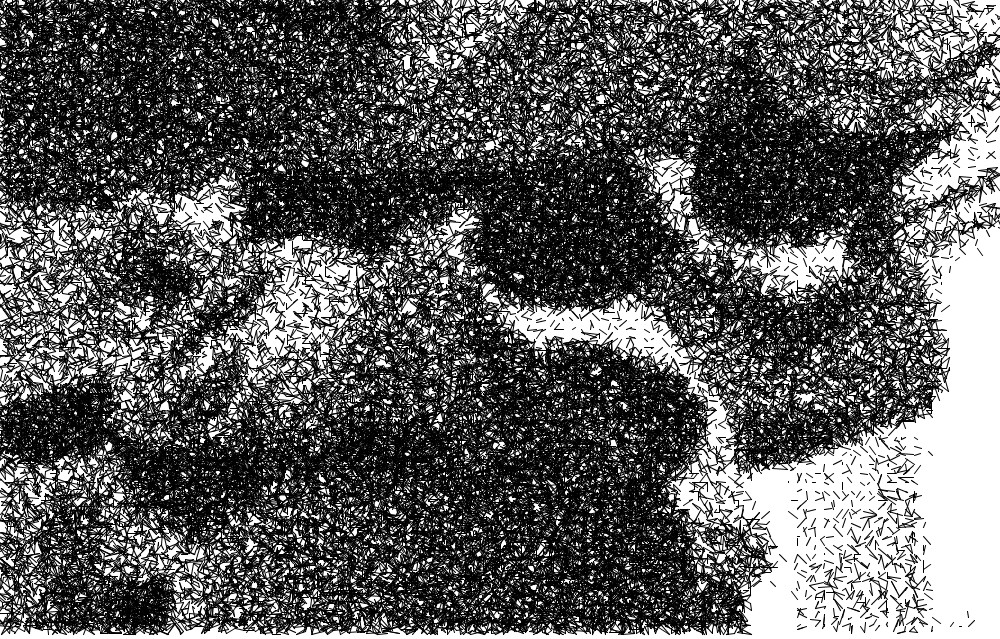
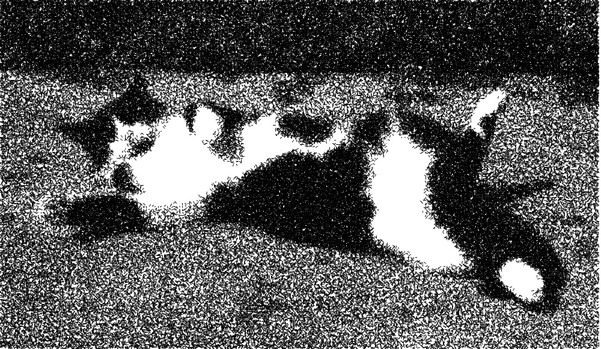
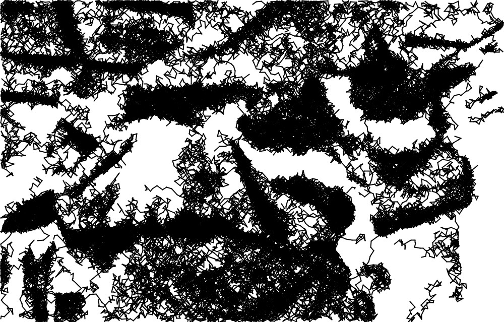
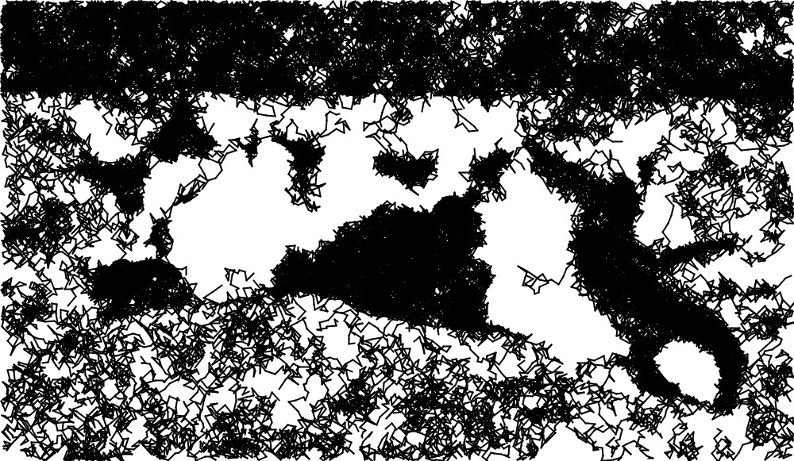

# scribbleplot
collection of my processing sketches used for transforming images to artsy plottable images (jpg/vector). Here are some output examples:

# randomLines [jpg,pdf]

# scribbleLines [jpg,pdf]

# reactionDiffusion [jpg, needs to be vectorized]

